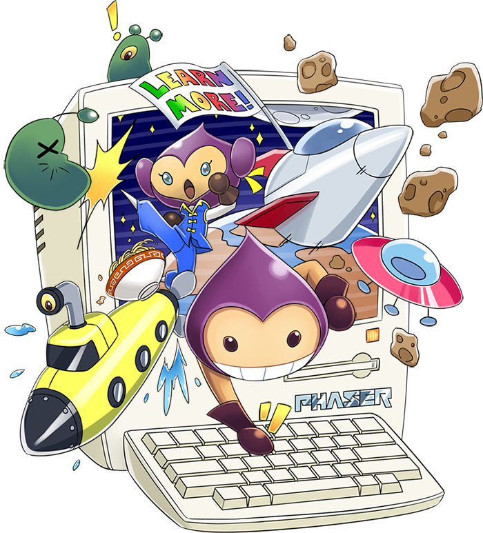

<p align="center">
  
</p>

<p align="center">
  Phaser 3 Game Examples written in TypeScript.
  Since 2018.
</p>

<div align="center">


[](https://github.com/prettier/prettier)


</div>

<p align="center">
  <sub>
    Examples made with ❤︎ by <a href="https://github.com/digitsensitive">digitsensitive</a></br>
    Framework created by <a href="https://github.com/photonstorm">Photonstorm</a>
  </sub>
</p>

# Phaser 3 and TypeScript

[Phaser](https://github.com/photonstorm/phaser) is a wonderful, fast and
free open source HTML5 game framework.
Here you will find everything you need to develop games with Phaser 3
in TypeScript. Have fun discovering, developing and playing!
Ideas and corrections are highly desirable to constantly
improve this repository!

<div align="center">
<a href="https://www.buymeacoffee.com/JZDVjsT26" target="blank">
</a>
</div>

## Getting started

### Prerequisites

```
Download and install Node.js @ https://nodejs.org/en
Download and install yarn @ https://classic.yarnpkg.com/en/docs/install
```

### Installing

Select a folder, navigate to it, and clone this repository
with this command-line:

```
git clone https://github.com/digitsensitive/phaser3-typescript.git
```

## Boilerplates

Check the `package.json` for the correct scripts to start projects.
For example you can start the `Webpack Boilerplate` project with:

```
yarn webpack-boilerplate
```

- [Webpack Boilerplate](https://github.com/digitsensitive/phaser3-typescript/blob/master/src/boilerplates/webpack-boilerplate)
- [Parcel Boilerplate](https://github.com/digitsensitive/phaser3-typescript/blob/master/src/boilerplates/parcel-boilerplate)

## Examples

Check the `package.json` for the correct scripts to start projects.
For example you can start the `Candy Crush` project with:

```
yarn candy-crush
```

- [Alpha Adjust](https://github.com/digitsensitive/phaser3-typescript/blob/master/src/games/alpha-adjust)
- [Asteroid](https://github.com/digitsensitive/phaser3-typescript/blob/master/src/games/asteroid)
- [Blockade](https://github.com/digitsensitive/phaser3-typescript/blob/master/src/games/blockade)
- [Blocks](https://github.com/digitsensitive/phaser3-typescript/blob/master/src/games/blocks)
- [Breakout](https://github.com/digitsensitive/phaser3-typescript/blob/master/src/games/breakout)
- [Candy Crush](https://github.com/digitsensitive/phaser3-typescript/blob/master/src/games/candy-crush)
- [Clocks](https://github.com/digitsensitive/phaser3-typescript/blob/master/src/games/clocks)
- [Coin Runner](https://github.com/digitsensitive/phaser3-typescript/blob/master/src/games/coin-runner)
- [Endless Runner](https://github.com/digitsensitive/phaser3-typescript/blob/master/src/games/endless-runner)
- [Flappy Bird](https://github.com/digitsensitive/phaser3-typescript/blob/master/src/games/flappy-bird)
- [Snake](https://github.com/digitsensitive/phaser3-typescript/blob/master/src/games/snake)
- [Space Invaders](https://github.com/digitsensitive/phaser3-typescript/blob/master/src/games/space-invaders)
- [Space Shooter](https://github.com/digitsensitive/phaser3-typescript/blob/master/src/games/space-shooter)
- [Super Mario Land](https://github.com/digitsensitive/phaser3-typescript/blob/master/src/games/super-mario-land)
- [Cellular Automaton](https://github.com/digitsensitive/phaser3-typescript/blob/master/src/experimental/cellular-automaton)
- [Fractal Tree](https://github.com/digitsensitive/phaser3-typescript/blob/master/src/experimental/fractal-tree)
- [Game of Life](https://github.com/digitsensitive/phaser3-typescript/blob/master/src/experimental/game-of-life)
- [Lissajous curve](https://github.com/digitsensitive/phaser3-typescript/blob/master/src/experimental/lissajous-curve)
- [Point in Polygon](https://github.com/digitsensitive/phaser3-typescript/blob/master/src/experimental/point-in-polygon)
- [Procedural Generation](https://github.com/digitsensitive/phaser3-typescript/blob/master/src/experimental/procedural-generation)
- [Raycasting](https://github.com/digitsensitive/phaser3-typescript/blob/master/src/experimental/raycasting)
- [Untextured Raycaster](https://github.com/digitsensitive/phaser3-typescript/blob/master/src/experimental/untextured-raycaster)
- [Factory Method](https://github.com/digitsensitive/phaser3-typescript/blob/master/src/patterns/creational-design-patterns/factory-method)

## Project Configurations

### Prettier

This project uses [Prettier](https://github.com/prettier/prettier), an opinionated code formatter.
The selected configuration options can be found in the `.prettierrc` file in the root project folder.
More informations about the format options can be found [here](https://prettier.io/docs/en/options.html).

### TypeScript

The selected compiler options for each project are set in the `tsconfig.json` file.
More informations about the available options can be found [here](https://www.typescriptlang.org/tsconfig).

## Tutorials

- [Learn to create a HTML5 Game in 5 Minutes](https://medium.com/@digit.sensitivee/learn-to-create-a-html5-game-in-5-minutes-604118f5d0ab)
- [Game Programming Patterns: The Factory Method by Example](https://medium.com/@digit.sensitivee/game-programming-patterns-the-factory-method-87d7f8c12081)

## External Resources and Tools

- [Phaser 3 Framework](https://github.com/photonstorm/phaser)
- [Phaser 3 Docs with TypeScript Definition File](https://github.com/photonstorm/phaser3-docs)
- [Phaser 3 Online Docs](https://photonstorm.github.io/phaser3-docs/index.html)
- [Phaser 3 Official Examples](https://github.com/photonstorm/phaser3-examples)
- [Phaser 3 Discourse](https://phaser.discourse.group)
- [Leshy SpriteSheet Tool](https://www.leshylabs.com/apps/sstool)
- [Tiled](https://www.mapeditor.org)
- [Bitmap Font Generator Online](https://snowb.org)
- [Tile Extruder](https://github.com/sporadic-labs/tile-extruder)

## Changelog

[Learn about the latest improvements](https://github.com/digitsensitive/phaser3-typescript/blob/master/CHANGELOG.md)

## Contributing

Want to correct a bug, contribute some code, or improve the codes? Excellent! Let me know!
Please read [CONTRIBUTING.md](https://github.com/digitsensitive/phaser3-typescript/blob/master/CONTRIBUTING.md) for details on our code of conduct.

I would like to thank the following persons for their support and help:
[@FakeBarenziah](https://github.com/FakeBarenziah)
[@emedws](https://github.com/emedws)
[@evanlanglais](https://github.com/evanlanglais)
[@iliyaZelenko](https://github.com/iliyaZelenko)

## License

This project is licensed under the MIT License - see the [LICENSE.md](https://github.com/digitsensitive/phaser3-typescript/blob/master/LICENSE) file for details.
